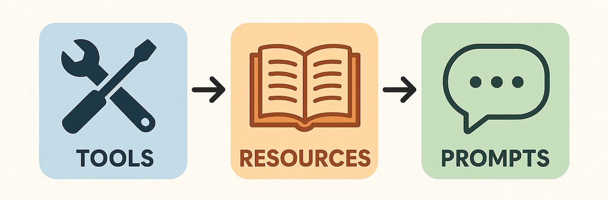
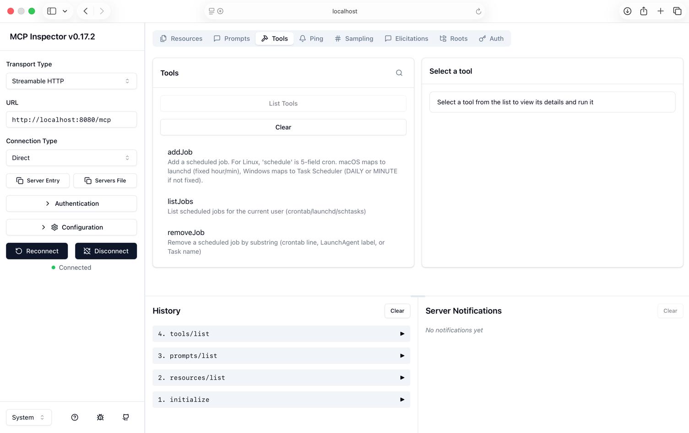

# cron-mcp

Cross-platform **cron and task scheduler integration layer** exposing a Model Context Protocol (MCP) server. `cron-mcp` lets you inspect, explain, and manage scheduled jobs across **Linux**, **macOS** and **Windows** via MCP **tools**, **resources**, and **prompts**.

---



**Concepts:**
- **Tools** are actions that the model can call — small, focused, safe operations that do work (not just read data). They let the model do something rather than just see something.
- **Resources** are external data sources or structured assets the model can access via the MCP server — e.g., files, APIs, databases, or any external systems. They make information available to the model for reference or grounding.
- **Prompts** define structured prompt templates that the model or user can trigger — these often combine tools and resources. They provide reusable, guided interactions. Think of them as prompt snippets with metadata.

---
**Debug and Test using MCP Inspector:**

- https://modelcontextprotocol.io/docs/tools/inspector

```shell
npx @modelcontextprotocol/inspector
```


